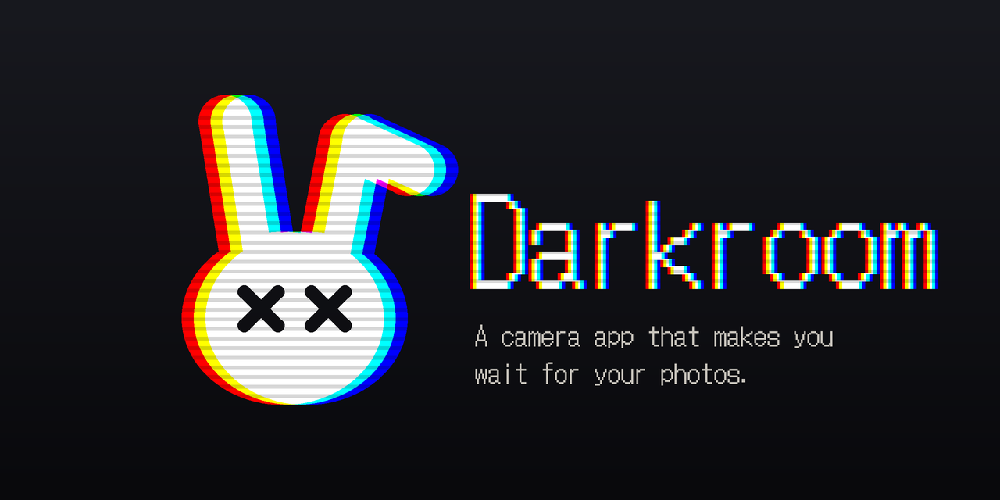

<p align="center"></p>

# Darkroom

A camera app that makes you wait for your photos.

Most camera apps give you the picture instantly and a hundred filters to pick from. Darkroom does the opposite: you pick an old film or an old camera, take the shot, and live with how it turns out. Film has to develop. Digital shots sit on a memory card until you copy them off. It's meant to make taking pictures feel a bit more like it used to.

## Film Mode

- **Five films:** Ektar 100 (clean, punchy colour), Portra 400 (soft, warm, visible grain), HP5 Plus 400 (black & white), Polaroid 600 (square instant prints in 8-shot packs) and a Super 8 movie camera.
- Every shot goes to the **darkroom** and takes about 5 minutes to develop (Polaroids fade in over 20 seconds). You get a quiet notification when it's ready.
- Developed prints get pinned to a **corkboard**. Each frame has real grain and the odd speck of dust or light leak, tuned against scans of the real films. You can write a note on a Polaroid's border.
- Super 8 reels play on a **projector** with tape-deck keys, fast forward and rewind that actually spool, and a label you can rename.
- Nothing goes to your phone's gallery until you hit **Save** (or **Save all**).
- Grain can be made weaker or stronger per film in settings.

## Digital Mode

- **Four cameras:** a 1999 floppy-disk camera, a 2003 CCD compact, a Y2K flip phone and a 90s camcorder (video with sound and an optional tape OSD).
- Shots are saved to a pretend **SD card** (the camcorder writes to floppy disks), browsed in a Windows 98-style file explorer.
- Files on the card are locked until you move them to the **C: drive**, which also copies them to your gallery.
- There are a few hidden things in the explorer's menus.

Swap between the two modes by tossing the camera off the desk with your thumb.

## Getting it

Every update builds a new release automatically. Open **[Releases](../../releases)** and take the latest build.

**Android:** download `Darkroom-N.apk` on your phone, open it and allow your browser to install apps when asked. Builds are signed with the same key, so each one installs over the last.

**iPhone (experimental):** download `Darkroom-N.ipa` and install it with [Sideloadly](https://sideloadly.io) and a free Apple ID. Free-account installs expire after 7 days; re-sideload to renew. Developing in the background is Android-only.

## Building from source

Needs Flutter (stable, 3.47 or newer).

```bash
flutter create --org com.darkroom --project-name darkroom --platforms android,ios .
flutter pub get
flutter run --release
```

The repository only holds the platform files we changed; `flutter create` fills in the rest without overwriting them. Checks: `flutter analyze` and `flutter test`.

| Where | What |
|---|---|
| `lib/` | The app (feature folders: camera, cameras, corkboard, darkroom, sd_card, settings, viewer) |
| `shaders/` | Live viewfinder looks (GLSL) |
| `test/` | Unit tests, look/shader contracts, screen tests at phone size |
| `tool/` | Icon generator, artwork renderer, film preview and smoke tests |
| `docs/` | [Developer guide](docs/DEVELOPMENT.md), [change log](docs/CHANGELOG.md), [new camera form](docs/NEW_CAMERA_FORM.md) |

## Status

A personal project, still early. Expect rough edges.

Built with Flutter.
